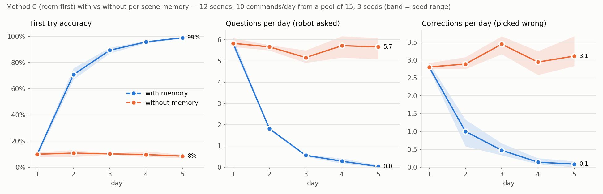

# CleanCmd object picking ("which sofa?")

No human annotation: ground truth is MP3D's own object instances and region labels (and, for the HM3D part,
GOAT-Bench's goal instances). Everything here is reproducible from the scripts in this folder plus
`vlmaps_cc/application/extract_anchor_detections.py`.

## Pipeline

| step | script | env / device |
|---|---|---|
| commands (MP3D) | `make_anchor_cmds.py --scene <scene>_<n>` -> `<scene>_anchor_cmds.jsonl` | vlmaps_3.9, CPU (navmesh PathFinder only) |
| commands (GOAT, HM3D) | `make_goat_cmds.py --dataset <scene>_<floor>` -> `<scene>_<floor>_anchor_cmds.jsonl` | vlmaps_3.9, CPU |
| VLMaps detections | `vlmaps_cc/application/extract_anchor_detections.py` -> `<tag>_detections.json` | vlmaps_3.9, CPU (`CUDA_VISIBLE_DEVICES=`) |
| methods A-D, scoring | `eval_anchor.py` (MP3D), `eval_goat.py` (GOAT) -> `results/` | CPU (D needs an ollama server) |
| memory study + plot | `memory_anchor.py`, `plot_memory.py` -> `results/memory_*` | CPU |

**Commands.** Categories with >= 2 annotated instances on the floor the VLMaps dataset covers (furniture-scale
mpcat40 classes; see `TARGETS`). Per instance: *bare* "next to the sofa"; *room* "next to the sofa in the living
room" only when that room label is unique in the scene and the instance is the only one of its category in it;
*landmark* "next to the table near the window" when the instance is within 1 m of a landmark and every other
instance of its category is >= max(1.5 m, d + 1 m) from all landmarks of that category. 3 random start poses per
command (navigable, same floor, within 1 m of a pose the map was built from). GOAT: the goal's own description
(`goat_lang`) plus a bare twin, for categories with >= 2 instances on that floor.

**Methods** (each picks one VLMaps detection that passes VLMaps' size filter, or asks):
A VLMaps rule (`select_front_objs` +-45 deg, then nearest), B nearest anywhere, C room-first (named room, else the
robot's current room; MP3D region polygons / HM3D region ids), D LLM picker (fixed prompt, temperature 0;
**not reported**: stopped partway on request, partial predictions are left untracked in `results/`).

**Score.** Correct = chosen detection centre within 1 m of the instance centre. Non-correct rows are attributed to
*missed* (no kept detection within 1 m of the instance: no method could pick it), *wrong* (detected, another one
picked) or *asked* (detected, the method asked).

## Results (MP3D, 12 datasets / 11 scenes, 3,867 rows)

| method | form | n | accuracy | ask rate | missed det. | wrong choice | asked (detected) |
|---|---|---|---|---|---|---|---|
| A vlmaps_front | bare | 3018 | 3.9% | 35.7% | 1461 | 1057 | 383 |
| A vlmaps_front | landmark | 585 | 4.3% | 43.6% | 324 | 160 | 76 |
| A vlmaps_front | room | 264 | 3.4% | 37.9% | 135 | 81 | 39 |
| A vlmaps_front | all | 3867 | 3.9% | 37.0% | 1920 | 1298 | 498 |
| B vlmaps_nearest | bare | 3018 | 6.0% | 10.6% | 1461 | 1377 | 0 |
| B vlmaps_nearest | landmark | 585 | 8.5% | 14.9% | 324 | 211 | 0 |
| B vlmaps_nearest | room | 264 | 9.1% | 10.2% | 135 | 105 | 0 |
| B vlmaps_nearest | all | 3867 | 6.6% | 11.2% | 1920 | 1693 | 0 |
| C room_first | bare | 3018 | 2.4% | 53.7% | 1461 | 791 | 694 |
| C room_first | landmark | 585 | 2.2% | 64.8% | 324 | 105 | 143 |
| C room_first | room | 264 | **37.5%** | 43.2% | 135 | 30 | 0 |
| C room_first | all | 3867 | 4.8% | 54.7% | 1920 | 926 | 837 |

Per scene: `results/anchor_tables.md`. Half the rows (1,920 / 3,867) fail before any choice is made: VLMaps has
no kept detection within 1 m of the instance (34-72% of instances detected, per scene). Among the
command forms, only naming the room helps, and only with a method that uses it (C: 37.5% vs 2-9% elsewhere).

## Results (GOAT-Bench language goals, HM3D val, 7 floors of 3 scenes, 97 goals, 582 rows)

| method | form | n | accuracy | ask rate | missed det. | wrong choice | asked (detected) |
|---|---|---|---|---|---|---|---|
| A vlmaps_front | goat_lang | 291 | 4.8% | 72.2% | 189 | 46 | 42 |
| A vlmaps_front | bare | 291 | 6.9% | 71.5% | 189 | 48 | 34 |
| B vlmaps_nearest | goat_lang | 291 | 11.0% | 50.5% | 189 | 70 | 0 |
| B vlmaps_nearest | bare | 291 | 11.3% | 50.5% | 189 | 69 | 0 |
| C room_first | goat_lang | 291 | 5.2% | 71.8% | 189 | 48 | 39 |
| C room_first | bare | 291 | 4.5% | 72.2% | 189 | 47 | 42 |

None of A-C reads the description, so `goat_lang` vs `bare` differ only by start pose. VLMaps finds 34 / 97
described instances within 1 m; for half the rows it has no island at all for the category (GOAT categories such
as "hanging clothes" or "kitchen cabinet" added to its label set). Scenes: 00800-TEEsavR23oF, 00802-wcojb4TFT35,
00808-y9hTuugGdiq (the HM3D-Sem minival scenes already on disk); maps from navmesh coverage tours
(`vlmaps_cc/dataset/generate_from_navmesh.py`).

## Memory learning curve (method C + per-scene memory, MP3D)

5 days x 10 commands/day from a pool of 15 phrases per scene (5 in YmJkqBEsHnH), each phrase meaning one fixed
instance; 3 seeds; with vs without memory. When the robot asks or is wrong, the simulated user answers "the one in
the <room>" / "the one near the <thing>" from the annotations, or leads the robot there.

| memory | day 1 | day 2 | day 3 | day 4 | day 5 |
|---|---|---|---|---|---|
| without: accuracy | 9.9% | 10.7% | 10.1% | 9.6% | 8.4% |
| with: accuracy | 9.9% | 70.7% | 89.3% | 95.7% | 98.8% |
| without: questions / day / scene | 5.83 | 5.67 | 5.17 | 5.72 | 5.67 |
| with: questions / day / scene | 5.83 | 1.81 | 0.56 | 0.28 | 0.03 |

Caveat: of the 1,110 memory hits after day 1, 941 replay a spot the user led the robot to (the hint-filtered retry
failed, usually because VLMaps never detected the instance); only 169 recall a detection the robot found from the
hint. So the gain is mostly "shown once, remembered", which a fixed-convention household makes easy.
