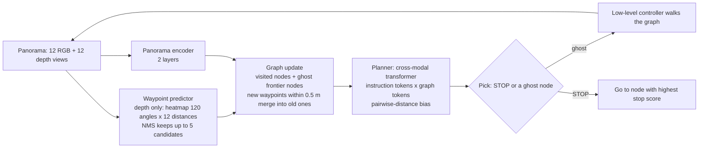
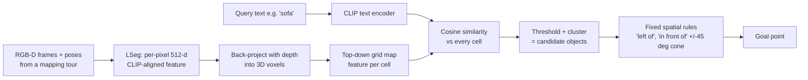
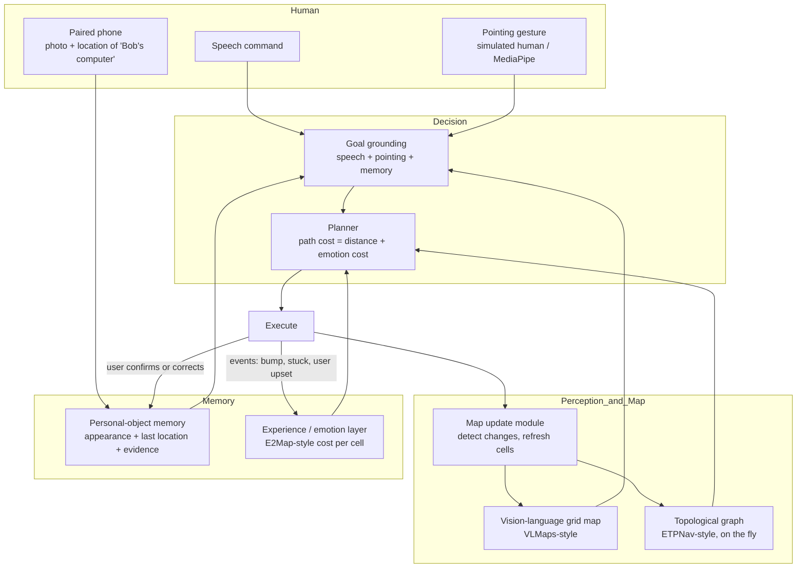
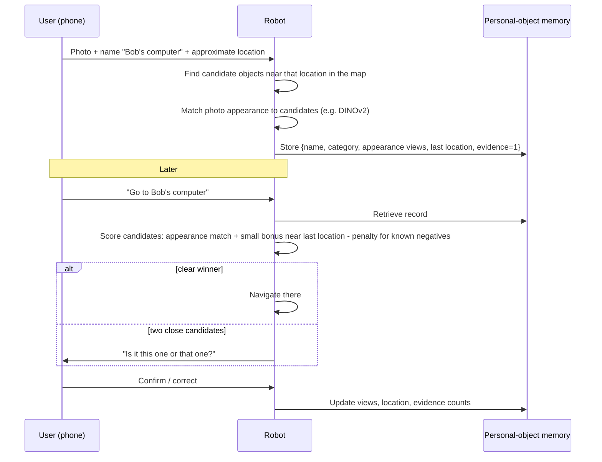
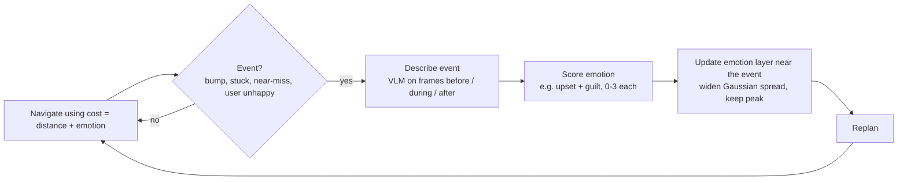
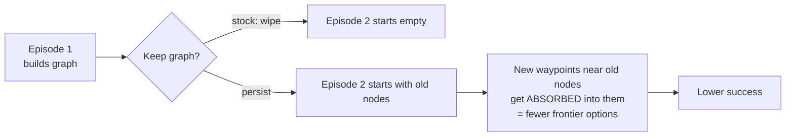
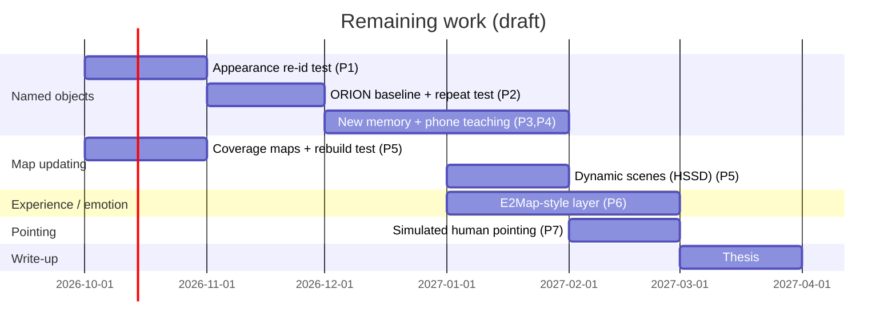

# MTP mid-term report: raw content pack

**For the report-writing agent.** This file is raw material for a *partial* (mid-term) MTP report. It contains facts, diagrams (Mermaid), figure files with captions, every result produced so far, and honest caveats. Write the report from this content in the institute template (chapter outline in Section 0). Rules:

- Do not invent results. Anything marked **NOT DONE** or **PLANNED** must appear as plan or future work, never as a result.
- Keep each caveat attached to its result (proxy ground truth, small n, simulator only, and so on).
- The human-interaction parts (pointing, phone teaching) are deliberately **kept broad**. Describe them as directions and system components, not as committed algorithms.
- Figures are in `figures/` next to this file. Mermaid diagrams can be rendered or redrawn.
- Dates: the work below was done Aug–Oct 2026. The report is being prepared in Oct 2026.

---

## 0. Report outline (institute template) and where the content is

| Template chapter | Content in this pack |
|---|---|
| List of Figures / Tables / Acronyms | Section 11 (figures), Section 12 (acronyms) |
| 1 Introduction (1.1 Intro, 1.2 Topic in context, 1.3 Motivation) | Section 1 |
| 2 Review (2.1 Existing methods, 2.2 Analysis, 2.3 Gaps) | Section 2 |
| 3 Problem statement (3.1 Formulation, 3.2 Objectives) | Section 3 |
| 4 Proposed methodology (4.1 Background, 4.2 System modelling, 4.3 Components) | Sections 4–5 |
| 5 Experiments and results (5.1 Setup, 5.2 Results so far) | Sections 6–8 |
| 6 Conclusions and future scope | Sections 9–10 |
| Bibliography | Section 13 |

---

## 1. Introduction material

### 1.1 One-paragraph framing

The project builds towards a **household robot (motivating example: a robot vacuum) that a family can talk to and teach**. The robot keeps a map of the home, follows spoken instructions ("go to Bob's computer", "clean near the sofa"), understands where a person is pointing, learns household-specific names for objects (taught by photo and location from a paired phone), keeps its map up to date as the home changes, and adjusts its behaviour from its own experiences, using an emotion-inspired cost map in the style of E2Map.

### 1.2 The five research themes (set by the supervisor)

1. **Pointing direction.** Humans refer to places and objects by pointing. The robot should combine a pointing gesture with speech ("clean *there*", "that one").
2. **Personalised named objects.** "Bob's computer", "grandma's chair". Names only this household uses, which no pretrained model knows.
3. **Map and plan generation.** Build a navigable map of the home and plan on it (on-the-fly topological graph à la ETPNav, metric vision-language map à la VLMaps).
4. **Regular map updating.** A home is a moderately dynamic environment: furniture moves and objects appear and disappear. The map must be kept current.
5. **Emotions and experiential learning.** The robot should remember what went wrong (bumped into something, got stuck, upset someone) and change its behaviour, as in E2Map (Kim et al., 2024/2025).

### 1.3 Motivation (points to use)

- Current language-navigation agents treat every instruction as a fresh, one-off task in an unseen building. A home robot lives in **one** home for years, with the **same** people.
- Pretrained vision-language models know generic categories ("computer") but not household identities ("Bob's computer"). Our measurements show they also often fail to find generic objects in home maps (Section 7.3).
- Homes change; a map built once goes stale.
- People communicate with gestures as much as words, and pointing is the most common referential gesture.
- Robots that cannot learn from experience repeat the same mistakes. E2Map shows a single bad experience can reshape a cost map and change behaviour in one shot.

---

## 2. Literature review material

All links were checked via search results (some arXiv pages could not be opened directly from the drafting environment). Verify author lists before final submission.

### 2.1 Existing methods by theme

**A. Vision-and-language navigation and topological maps (theme 3)**

| Work | Key idea | Relevance |
|---|---|---|
| R2R (Anderson et al., CVPR 2018) [arXiv:1711.07280](https://arxiv.org/abs/1711.07280) | Route-instruction benchmark in Matterport3D | Data used |
| VLN-CE (Krantz et al., ECCV 2020) [arXiv:2004.02857](https://arxiv.org/abs/2004.02857) | R2R in continuous motion inside Habitat | Setting used |
| **ETPNav** (An et al., TPAMI 2024) [arXiv:2304.03047](https://arxiv.org/abs/2304.03047) | Builds a topological graph online (visited nodes + frontier "ghost" nodes from a depth-based waypoint predictor); a cross-modal transformer picks the next node | Our main codebase; on-the-fly graph generation and localisation |

**B. Spatial vision-language maps (themes 3, 4)**

| Work | Key idea | Relevance |
|---|---|---|
| **VLMaps** (Huang et al., ICRA 2023) [arXiv:2210.05714](https://arxiv.org/abs/2210.05714); journal version IJRR 2025 [arXiv:2506.06862](https://arxiv.org/abs/2506.06862) | Fuses LSeg pixel features into a top-down grid; open-vocabulary lookup; spatial goals ("left of", "between") by fixed geometric rules | Second codebase; base map for named objects and the emotion layer |
| LSeg (Li et al., ICLR 2022) [arXiv:2201.03546](https://arxiv.org/abs/2201.03546) | Language-driven semantic segmentation | VLMaps' feature extractor |
| HOV-SG (Werby et al., RSS 2024) [arXiv:2403.17846](https://arxiv.org/abs/2403.17846) | Floor → room → object open-vocabulary scene graph | Room-first lookup |
| QuASH (Pekkanen, Verdoja, Kyrki, 2025) [arXiv:2510.14546](https://arxiv.org/abs/2510.14546) | Better queries on VLMaps-style maps using synonyms/antonyms | Common-noun queries |
| SpCoTMHP (Taniguchi et al., Frontiers 2024) [DOI 10.3389/frobt.2024.1291426](https://www.frontiersin.org/journals/robotics-and-ai/articles/10.3389/frobt.2024.1291426/full) | Learns environment-specific place names ("Bob's study") from on-site speech | Personal place names |

**C. Personalised named objects (theme 2)**

| Work | Key idea | Relevance |
|---|---|---|
| **ORION / ZIPON** (Dai, Peng, Li, Chai; ICRA 2024) [arXiv:2310.07968](https://arxiv.org/abs/2310.07968), code [sled-group/navchat](https://github.com/sled-group/navchat) | GPT-4 controller drives modules (VLMaps-style map, Grounded-SAM detector, frontier exploration, memory, talk). Memory = two maps (M_pos, M_neg) storing the CLIP **text** feature of a confirmed name on the object's map area. HM3D, 10 scenes, 117 personalised goals, GPT-3.5 simulated user | Closest prior work; main baseline |
| PersONAL (2025) [arXiv:2509.19843](https://arxiv.org/abs/2509.19843) | Benchmark: find objects associated with a person ("Lily's backpack") | Benchmark for theme 2 |
| User-Centric Object Navigation (Wang, Zhu, Dong, 2026) [arXiv:2602.06459](https://arxiv.org/abs/2602.06459) | 22.6k user placement habits steer search | Personal habits |
| EgoAsk (2026) [arXiv:2609.16766](https://arxiv.org/abs/2609.16766) | Teaching personal object knowledge to household robots by asking | Teaching by interaction |
| PAHF (2026) [arXiv:2602.16173](https://arxiv.org/abs/2602.16173) | Per-user memory updated from feedback: ask, act from memory, update | Memory from feedback |
| TidyBot (Wu et al., 2023) [arXiv:2305.05658](https://arxiv.org/abs/2305.05658) | LLM summarises a user's tidying preferences | Personal preferences |
| DINOv2 (Oquab et al., 2023) [arXiv:2304.07193](https://arxiv.org/abs/2304.07193) | Self-supervised visual features, good for instance matching | Proposed appearance memory |
| Grounding DINO (Liu et al., 2023) [arXiv:2303.05499](https://arxiv.org/abs/2303.05499) | Open-set detector (used inside Grounded-SAM by ORION) | Detector |

**D. Dynamic environments and map updating (theme 4)**

| Work | Key idea | Relevance |
|---|---|---|
| Scene Graph Memory (Kurenkov et al., ICML 2023) [arXiv:2305.17537](https://arxiv.org/abs/2305.17537) | Predicts where objects moved in changing homes | Dynamic homes |
| EvoNav-Bench (2026) [arXiv:2609.08292](https://arxiv.org/abs/2609.08292) | Lifelong navigation while scenes evolve | Benchmark for theme 4 |
| Beyond the Remembered World (2026) [arXiv:2609.39166](https://arxiv.org/abs/2609.39166) | Predictive 4D belief; static vs routine vs random evolving worlds (HSSD) | Evaluation design for theme 4 |
| GOAT-Bench (Khanna et al., CVPR 2024) [arXiv:2404.06609](https://arxiv.org/abs/2404.06609) | 5–10 sequential goals (name, image, language) per episode in one home | Lifelong multi-goal evaluation |
| NavHarness (2026) [arXiv:2609.34276](https://arxiv.org/abs/2609.34276) | Memory of maps, house knowledge and corrections across tasks | Lifelong memory |

**E. Emotion and experiential learning (theme 5)**

| Work | Key idea | Relevance |
|---|---|---|
| **E2Map** (Kim, Kim, Oh, et al.; Seoul National Univ., Stanford; arXiv v4 Feb 2025) [arXiv:2409.10027](https://arxiv.org/abs/2409.10027), [e2map.github.io](https://e2map.github.io/) | Builds a VLMaps-style grid (LSeg features) and adds per-cell **emotion parameters**: a Gaussian per occupied cell, emotion E(x) = Σ w·N(x). On an event, GPT-4o describes 3 frames (before, during, after); Llama 3 scores **upsetness** and **guiltiness** (0–3 each, summed); the Gaussian's spread is enlarged (Weber–Fechner log update) and the weight rescaled; D* replans with emotion as cost; MPPI control. Gazebo + real robot. Sim results: static VLMaps 10/10, E2Map 10/10; danger sign VLMaps 0/10 vs E2Map 9/10; human-wall 0/10 vs 9/10; dynamic door 0/10 vs 9/10 | Template for theme 5 |

**F. Pointing and gestures (theme 1)**

| Work | Key idea | Relevance |
|---|---|---|
| MediaPipe (Lugaresi et al., 2019) [arXiv:1906.08172](https://arxiv.org/abs/1906.08172) | Real-time pose and hand landmark pipelines | Pointing-ray extraction tool |
| LEGS-POMDP (2026) [arXiv:2603.04705](https://arxiv.org/abs/2603.04705) | Language- and gesture-guided object search in partially observable environments | Closest to theme 1 |
| CAPE (2025) [arXiv:2507.21888](https://arxiv.org/abs/2507.21888) | CLIP-aware pointing heatmaps for embodied reference understanding | Pointing + language grounding |
| Embodied Referring Expression Comprehension in HRI (2025) [arXiv:2512.06558](https://arxiv.org/abs/2512.06558) | Referring expressions with gestures in HRI | Pointing + language |
| Evaluating Pointing Gestures for Target Selection in HRC (2025) [arXiv:2506.22116](https://arxiv.org/abs/2506.22116) | How accurately pointing selects targets | Pointing accuracy limits |

**G. Home cleaning robots (application context)**

| Work | Relevance |
|---|---|
| RoboClean (Fuentes et al., CUI 2023): Wizard-of-Oz study of spoken commands to a robot vacuum [paper](https://nottingham-repository.worktribe.com/index.php/output/23220530/roboclean-contextual-language-grounding-for-human-robot-interactions-in-specialised-low-resource-environments), [dataset](https://rdmc.nottingham.ac.uk/handle/internal/10465) | Real command forms people use |
| VLM-Vac (2024) [arXiv:2409.14096](https://arxiv.org/abs/2409.14096) | Vacuum that learns what to avoid or suck up, via VLM distillation |
| Coverage path planning surveys: Galceran & Carreras 2013 [link](https://www.sciencedirect.com/science/article/pii/S092188901300167X); Bormann et al. ICRA 2018 [link](https://ieeexplore.ieee.org/abstract/document/8460566/) | Floor coverage itself is a well-studied, separate problem |

### 2.2 Analysis (comparison matrix)

| Capability | ETPNav | VLMaps | ORION | E2Map | Pointing work | **This project (target)** |
|---|---|---|---|---|---|---|
| Builds its own map online | Topological, per episode | Metric, built once | VLMaps-style + exploration | VLMaps-style, built once | – | Yes |
| Keeps the map across tasks | No (wiped each episode) | Static | Static map + memory | Static + emotion layer | – | Yes, updated |
| Household-specific names | No | No | Yes (text feature at a location) | No | – | Yes (appearance + location) |
| Handles pointing | No | No | No | No | Yes | Yes (broad) |
| Learns from its own experience | No | No | Memory of user answers | Yes (emotion cost) | No | Yes |
| Dynamic home | No | No | Not tested | Dynamic obstacles/events | – | Yes |

### 2.3 Research gaps (state carefully, without overclaiming)

1. **No system brings these together** for a home robot: personal names, pointing, a map that is kept up to date, and experience-driven behaviour. Each exists separately.
2. **ORION's memory is location-bound and barely evaluated.** It stores a name's text feature on map cells, so it cannot re-find a moved object. ORION's own paper: *"the memory module has a limited impact... previously stored goals aren't retested"*; only one re-test pass was run (SR 83.8% → 91.5%). Its simulated user is always truthful.
3. **ETPNav's map is thrown away after every episode.** Our experiments (Section 7.5) show that naively keeping it *hurts*, which is a non-trivial problem in its own right.
4. **E2Map's emotion layer is tied to a static map** and tested on navigation hazards; it has not been combined with personal names or human interaction.
5. **Pointing + speech + a persistent home map** has not been combined for household navigation, to our knowledge (verify with a further search before claiming this strongly).

---

## 3. Problem statement material

### 3.1 Formulation (broad)

A robot R lives in one home H over many days. It maintains a map M_t (a metric vision-language grid plus a topological graph) that changes over time. A user gives a command u = (speech, optional pointing gesture g, optional phone teaching input p). The robot must:

1. ground u to a goal (an object, a named object, or a region), using M_t, its personal-object memory K_t, and g;
2. plan and execute a path on M_t, with costs that include learned experience E_t (emotion-like cost layer);
3. after acting, update M_t (changes it observed), K_t (names confirmed or corrected) and E_t (events experienced).

Success is measured over **repeated use in the same home**, not single episodes.

### 3.2 Thesis objectives (draft)

1. Build and validate the simulation pipeline (Habitat + ETPNav + VLMaps) on standard benchmarks. **Done** (Section 7.1).
2. Characterise where existing navigation and mapping fail for household commands. **Largely done** (Sections 7.2–7.4).
3. Study map persistence and updating across episodes in one home. **Started** (Section 7.5).
4. Design a personal-object memory taught from a paired phone (photo + location), improving on ORION's location-bound memory. **Designed, not implemented** (Section 5.2).
5. Add an experience/emotion cost layer in the style of E2Map on top of our map. **Planned** (Section 5.4).
6. Add pointing-gesture input via a simulated human / pose estimation. **Planned, kept broad** (Section 5.1).

---

## 4. Background: how the two codebases work (methodology Section 4.1)

### 4.1 ETPNav per-step loop (traced through the code)

Facts: maximum 15 high-level steps per episode; success = within 3 m of the goal (geodesic); visited nodes cannot be selected (masked); the waypoint predictor sees depth only, never RGB. Paper figures: `figures/etpnav_paper_overview.png`, `figures/etpnav_paper_mapping.png` (from the ETPNav repository; cite An et al.).

### 4.2 VLMaps map building and lookup

---

## 5. Proposed system (methodology Sections 4.2–4.3)

### 5.0 Overall architecture

### 5.1 Pointing direction (kept deliberately broad)

- **Input:** a person's body pose from the robot's camera (MediaPipe Pose/Hands in the real world; a **simulated human** with a known pointing pose in simulation).
- **Signal:** a pointing ray (e.g. from eye or shoulder through the wrist/fingertip), projected onto the floor map as a cone of likely targets.
- **Fusion:** combine the cone with the spoken words ("that chair", "clean there") and the map's candidates. Pointing narrows *where*; words narrow *what*.
- **Status: NOT STARTED.** Open choices to leave undecided in the report: ray definition, how the simulated human is rendered in Habitat, and how ambiguity is resolved (ask vs pick).

### 5.2 Personalised named objects, taught from a phone

**Idea.** The user takes a photo of an object on the paired phone, says or types its name ("Bob's computer"), and the phone's location (or a tap on the app's map) tells the robot roughly where it is.

**Difference from ORION (the improvement claimed):**

| | ORION memory | Proposed memory |
|---|---|---|
| What is stored | CLIP *text* feature of the name, painted on the object's map cells | Object *appearance* (image features from several views) + category + last location as a hint + evidence counts |
| Object moved | Memory points at the old place; fails | Appearance still matches at the new place |
| Map rebuilt | Tied to cells of the old map | Location hint in world coordinates; appearance independent of the map |
| Wrong or contradicting answers | Stored as given | Evidence counts; ask when evidence conflicts |
| Teaching | Only through dialogue during navigation | Also directly from a phone photo + location |

**Known risk:** truly identical objects (six identical dining chairs) cannot be told apart by appearance; location and context must be used. Report this as a limitation and an analysis point.

**Status: DESIGNED, NOT IMPLEMENTED.** The planned first test is in Section 8.

### 5.3 Map generation and updating

- **Generation:** a metric VLMaps-style grid built from a mapping tour, plus ETPNav's on-the-fly topological graph for localisation and planning.
- **Updating:** keep the map across episodes and refresh it as the robot re-observes the home. Section 7.5 shows that the naive version of this (simply keeping ETPNav's graph) **hurts** performance, and identifies why (waypoint absorption into old nodes). This is evidence that updating needs care, not just storage.
- **Status: persistence experiments DONE (Exp 1–5); change detection and refresh NOT STARTED.**

### 5.4 Emotion and experiential learning (E2Map-style)

- Our VLMaps pipeline already builds the same kind of grid E2Map uses (LSeg features per cell), so the emotion layer can be added to it directly.
- Possible household extensions (keep broad): events from the vacuum context (stuck under a chair, tangled in cables, pushed a pet bowl); positive experiences as well as negative; tying emotion to *objects* in the personal-object memory, not only to cells, so the lesson moves with the object.
- **Status: NOT STARTED.** E2Map paper studied; its numbers are in Section 2.1-E.

---

## 6. Experimental setup (facts)

| Item | Value |
|---|---|
| Simulator | Habitat-Sim 0.1.7 + Habitat-Lab 0.1.7 (ETPNav env `vlnce`, Python 3.6, torch 1.9.1); Habitat-Sim 0.3.1 (VLMaps env `vlmaps_3.9`, Python 3.9, torch 2.8) |
| Scenes | Matterport3D (all 90 scenes downloaded; experiments on 11 scenes / 12 floor datasets); HM3D-Sem minival (4 scenes, from GOAT-Bench) |
| Benchmarks | R2R-CE, RxR-CE (val_unseen); GOAT-Bench language goals (subset) |
| Checkpoints | ETPNav `release_r2r`, `release_rxr` (pretrained, not retrained) |
| Hardware | Workstation with one NVIDIA T1000 8 GB (ETPNav inference); lab machine "storms-end" (VLMaps map building, experiments) |
| VLMaps map building | ~2.1 s per frame; 11 MP3D maps from R2R-tour poses took 13–91 min each (355–2,679 frames); full-coverage-tour maps being rebuilt |
| Code | Fork of ETPNav (`the1andonlymanojos/ETPNav`, branch `claude/blissful-hopper-g17zm9`); fork of VLMaps (`the1andonlymanojos/vlmaps`, private) |
| Bugs fixed in VLMaps | `_reserve_map_space` return-value bug; index mismatch in `get_pos_in_between` |

---

## 7. Results so far (results chapter, Section 5.2)

### 7.1 Reproduction of ETPNav (pipeline validated)

| Benchmark | Our run | Paper (TPAMI 2024) |
|---|---|---|
| R2R-CE val_unseen, 50 episodes | SR 68.0%, SPL 61.4%, NDTW 73.2% | SR 66.19%, SPL 59.37% (Table 2) |
| RxR-CE val_unseen, 51 episodes, 11 scenes, English only | SR 54.9%, SPL 46.8%, NDTW 59.9% | SR 61.46%, SPL 50.83%, NDTW 66.41% (Table 3, all languages) |
| RxR-CE val_unseen, 20 episodes, 1 scene | SR 50.0%, SPL 42.9%, NDTW 47.1% | – |

Caveats: small n; English-only RxR. **Correction to an earlier internal note:** our runs had `ALLOW_SLIDING=True`, which disables the "Tryout" controller in the code (`use_tryout = IL.tryout and not ALLOW_SLIDING`). So comparisons to the paper's Table 9 "Heuristic w/ Tryout" row are not like-for-like. Compare with the headline numbers above instead.

Screenshots (left: panoramic RGB; right: top-down map with path; bottom: instruction):
- `figures/etpnav_rxr_couch_mid.png`, `figures/etpnav_rxr_couch_end.png`: RxR checkpoint rollout.
- `figures/etpnav_custom_sofa_mid.png`, `figures/etpnav_custom_sofa_end.png`: free-text instruction rollout.

### 7.2 ETPNav on short spatial commands (fails)

- 25 commands of the form "move to the left/right of / behind / next to the X" (X a real annotated object), scene zsNo4HB9uLZ, R2R checkpoint, success = final position within 1.5 m of a geometrically computed target.
- **Result: 2/25 (8%).**
- **Rephrasing does not help.** 4 failed cases × 5 phrasings (bare → fully narrated R2R style). In 3 of 4 cases the final distance was identical to two decimals across all phrasings.
- Interpretation: the agent reaches the right neighbourhood but not the right side. R2R training instructions almost never ask for an offset from a named object.
- "Hybrid grounding" (look up the object's true position, walk there with the shortest-path planner) gives 25/25, **but this uses privileged ground-truth coordinates and is not a method result**. Report it only as an upper bound or sanity check.
- Screenshots: `figures/etpnav_spatial_success_p10_end.png` (a success), `figures/etpnav_spatial_fail_p14_mid.png` and `_end.png` ("Move to the right of the sofa", fails), `figures/hybrid_grounding_p3_*.png` (privileged walk).

### 7.3 ETPNav vs VLMaps on the same 25 commands (pilot)

Ground truth: a **geometric proxy** (cells within 0.75 m of a computed target point), not human annotation; left/right relative to the robot's start view.

| Method | Successes | Median distance answer→target | Within 2 m |
|---|---|---|---|
| ETPNav | 0/25 | 5.26 m | 4/25 |
| VLMaps | 1/25 (17 answered) | 2.25 m | 6/17 |
| VLMaps, correct object given (oracle) | 2/25 | 1.25 m | 18/20 |

- VLMaps ended closer than ETPNav on 15 of the 17 commands both answered (sign test p ≈ 0.002).
- **Wrong object is the main error:** VLMaps anchored on the wrong instance in 9 of 17 answered commands, and wrong objects account for 75% of its total distance error.
- Figure: `figures/zsNo4HB9uLZ_pilot_topdown.png`. Four example commands on the top-down map: proxy target (green), anchor (star), ETPNav path (blue, × = end), VLMaps answers (red/orange), correct-object variants.

### 7.4 Object grounding in VLMaps maps ("which sofa?")

Commands generated from Matterport3D's object annotations (not written by people), 12 floor datasets, 3,867 rows. Correct = chosen object within 1 m of the intended instance.

| Method | Bare ("next to the sofa") | With landmark | With room named | All | Asks |
|---|---|---|---|---|---|
| A: VLMaps rule (±45° cone, nearest) | 3.9% | 4.3% | 3.4% | 3.9% | 37% |
| B: nearest anywhere | 6.0% | 8.5% | 9.1% | 6.6% | 11% |
| C: room first | 2.4% | 2.2% | **37.5%** | 4.8% | 55% |
| G: room first only if a room is named, else B | 6.0% | 8.5% | 37.5% | 8.5% | 13.5% |

- **Half of all failures happen before any choice:** in 1,920 of 3,867 rows the target object is never detected in the map. Per scene, VLMaps detects 34–72% of target instances.
- An open-vocabulary detector (query with the exact words; CLIP ViT-B/32; threshold tuned on one scene) recovered 135 of the missed rows but lost 318 others. It halved false candidates per command (8.75 → 4.78). G stayed at 8.6%.
- Of 447 distinct instances missed by both detectors: **184 never observed** during mapping, 159 below threshold, 104 merged into a larger cluster. This motivated rebuilding maps from full-coverage tours (in progress).
- GOAT-Bench check (HM3D, 97 language goals, 582 rows): A 5.8%, B 11.2%, C 4.8%. VLMaps detected only 34 of 97 goal objects. Small sample; HM3D has no room labels.

**Takeaway for the report:** generic map lookup is unreliable in real home scans. This motivates teaching objects directly (phone photo + location) rather than relying on detection alone.

### 7.5 Keeping ETPNav's map across episodes (map persistence: themes 3–4)

Setting: one house (zsNo4HB9uLZ), 3 tours × 15 real R2R-CE episodes = 45 episodes, fixed order. Success = within 3 m.

| Experiment | Configuration | Successes / 45 |
|---|---|---|
| Exp 1 (baseline) | Stock ETPNav, map wiped every episode | **27/45 (60%)** |
| Exp 2/3 | Persist full graph | 11/45 |
| Exp 3 | Persist a window of recent nodes (10 / 20 / 40) | 11 / 15 / 13 of 45 |
| Exp 3 | Persist + hide old frontiers ("cur" variants) | 7/45 (both full and window-20) |
| Exp 4 | Persist, but absorption limited to the current episode | **27/45**, identical to baseline per tour and per episode |
| Exp 4 | Persist, absorption into all old nodes (window 20 / full) | 15 / 14 of 45 |
| Exp 5 | On top of Exp 4: reopen old nodes as frontiers within radius r | r = 0: 28/45; 1.5 m: 23; 3 m: 22; 6 m: 20; 30 m: 20 |

- Every naive persisted variant is worse than the baseline (sign test p ≤ 0.017 for each, Exp 3).
- **Mechanism found (Exp 4):** hiding old visited nodes from the planner changes nothing. The damage comes from new waypoints being silently **absorbed** into old nodes, which starves the planner of frontier options. Limiting absorption to the current episode restores the baseline exactly.
- Exp 5: making remembered places selectable again hurts as soon as it does anything. The planner cannot judge whether a remembered place is relevant to the new instruction.
- Engineering: a self-test with 3,000+ randomised states guards the planner-input invariants. A real crash bug was found and fixed (reopened tokens were misread as real nodes because of an `id.startswith('g')` check).

**Takeaway:** a persistent home map does not help a VLN planner trained on one-shot episodes. Map memory must be used deliberately (for example as a separate metric map and memory), not just fed back into the graph. This directly motivates themes 3–4.

### 7.6 Memory from user corrections (simulated): early test of themes 2 and 5

Method G with a simple memory: after the robot asks, the simulated user's answer is stored per phrase and reused. 12 floor datasets, 10 commands/day, 5 days, 3 seeds. Three simulated users: consistent; 30% inconsistent (wrong instance 30% of the time); random (random instance of the category each time).

| User | Memory | Day 1 | Day 5 | Day 5, target detected only | Questions/day, day 1 → 5 |
|---|---|---|---|---|---|
| any | without | 13.6% | 14.8% | 36.4% | 2.00 → 1.78 |
| consistent | with | 13.6% | 98.0% | 95.7% | 2.00 → 0.00 |
| 30% inconsistent | with | 13.6% | 91.6% | 92.7% | 2.00 → 0.00 |
| random | with | 13.6% | **55.1%** | 68.4% | 2.00 → 0.00 |

Figures: `figures/memory_users_curve.png` (three panels: accuracy; accuracy on detected targets only; questions per day), `figures/memory_curve.png` (consistent user only, earlier run).

**Honest reading (must stay in the report):**
- Memory helps even the **random** user (55% vs 15%), so much of this gain is *lookup*: once any answer is stored, the robot stops asking and replays it. With only a few instances per category, a random answer is often right by chance.
- Questions drop to zero for every user, including the random one. The memory never re-asks, even when its stored answers are wrong. This is the weakness that evidence counts and re-asking (Section 5.2) are meant to fix.
- 718 of the consistent user's memory hits were on objects the map never detected: the memory works because the user led the robot there, not because perception improved. This supports teaching objects directly (phone photo + location).

---

## 8. Planned experiments (results chapter: "in progress / next")

| # | Experiment | Theme | Status |
|---|---|---|---|
| P1 | Appearance re-identification: can DINOv2 / CLIP image features pick the right instance among same-category look-alikes in HM3D-Sem (4 scenes; render 8 views per instance, 4 memory / 4 query)? Report top-1 vs chance | 2 | Prompt written, not run |
| P2 | Run ORION (public code) as baseline in our Habitat/HM3D setup; repeat its goals over 5+ sessions (the re-test its paper skipped); add an inconsistent user | 2 | Not started; needs a GPT-4 API key |
| P3 | Replace ORION's memory with the appearance + evidence memory; compare across sessions, map rebuilds and imperfect users | 2 | Not started |
| P4 | Phone teaching simulation: a rendered "photo" of the object from a nearby viewpoint + noisy location (± 1–2 m) as the teaching input | 2 | Not started |
| P5 | Map change: rebuild maps from full-coverage tours (in progress); learn on one map, test on the other; HSSD scenes with movable objects for real changes | 3, 4 | Coverage maps building |
| P6 | E2Map-style emotion layer on our VLMaps grid; household events (stuck, collision, user unhappy); one-shot behaviour change | 5 | Not started |
| P7 | Pointing: simulated human with a pointing pose in Habitat; pointing cone + words → target | 1 | Not started |

---

## 9. Conclusions so far (for chapter 6)

1. The simulation pipeline is working and reproduces ETPNav's published numbers.
2. Off-the-shelf language navigation (ETPNav) fails at short household-style object-relative commands (8% on 25 probes); rewording does not help.
3. Map-based lookup (VLMaps) gets closer but picks the wrong object most of the time. Half of the target objects are never detected in the map, which argues for teaching objects directly.
4. Naively keeping ETPNav's map across episodes hurts; we identified the mechanism (waypoint absorption) and a fix that restores the baseline. Making memory *useful*, not just harmless, is open.
5. A simple memory of user answers boosts accuracy, but a random-user control shows much of the gain is lookup. Evaluating memory needs such controls; ORION did not use them.
6. E2Map provides a concrete, compatible template for the experiential/emotional layer, since it is built on the same kind of map we already build.

## 10. Future scope / timeline (draft; adjust to the real MTP dates)

---

## 11. Figure list (files in `figures/`)

| File | Caption |
|---|---|
| `etpnav_paper_overview.png` | ETPNav architecture overview (from the ETPNav repository; cite An et al., TPAMI 2024) |
| `etpnav_paper_mapping.png` | ETPNav online topological mapping (same source) |
| `etpnav_rxr_couch_mid.png`, `_end.png` | ETPNav RxR checkpoint rollout: panorama (left), top-down map and path (right), instruction (bottom); middle and end of the episode |
| `etpnav_custom_sofa_mid.png`, `_end.png` | ETPNav following a free-text instruction about a sofa (custom episode) |
| `etpnav_spatial_success_p10_end.png` | One of the 2/25 spatial-probe successes |
| `etpnav_spatial_fail_p14_mid.png`, `_end.png` | Failure: "Move to the right of the sofa." The agent explores the right area but does not reach the right side of the sofa |
| `hybrid_grounding_p3_mid.png`, `_end.png` | Privileged "hybrid grounding" walk (ground-truth coordinates; upper bound only) |
| `zsNo4HB9uLZ_pilot_topdown.png` | Pilot comparison on 4 example commands: proxy target, anchor, ETPNav path, VLMaps answers, correct-object variants |
| `memory_curve.png` | Memory over 5 simulated days, consistent user (earlier run) |
| `memory_users_curve.png` | Memory with consistent, 30% inconsistent and random users vs no memory: accuracy, accuracy on detected targets, questions per day |

More raw material in the repository: 136 rollout videos in `docs/session-findings/videos/`; all result JSONs in `docs/session-findings/results/`, `docs/experiments/`, `cleancmd/anchor/results/`. Published interactive pages (private; share before citing):
- RxR task gallery: https://claude.ai/code/artifact/74ab085d-4e40-4b5d-9985-961ccd258bf1
- Spatial instruction test: https://claude.ai/code/artifact/8b48e08f-580d-4d4b-ae01-19c6fc2c7d59
- Phrasing test: https://claude.ai/code/artifact/5a6869a9-e1b7-4293-bcae-f0731a4fed47
- Hybrid grounding: https://claude.ai/code/artifact/71b771b8-fd48-4637-85a0-0b950dc10331
- Annotated walk through the ETPNav code: https://claude.ai/artifact/5dNZTryyVJq56M7JYvvKeE

## 12. Acronyms

VLN: vision-and-language navigation · VLN-CE: VLN in continuous environments · R2R: Room-to-Room · RxR: Room-across-Room · SR: success rate · SPL: success weighted by path length · NDTW: normalised dynamic time warping · SIT: success weighted by interaction turns (ORION) · VLM: vision-language model · LMM: large multimodal model · LLM: large language model · MP3D: Matterport3D · HM3D: Habitat-Matterport 3D · HSSD: Habitat Synthetic Scenes Dataset · LSeg: language-driven semantic segmentation · CLIP: contrastive language-image pre-training · OV: open-vocabulary · E2Map: Experience-and-Emotion Map · ZIPON: zero-shot interactive personalised object navigation · MPPI: model predictive path integral (control).

## 13. Bibliography (core; links in Section 2)

ETPNav; VLMaps (ICRA 2023 and IJRR 2025); LSeg; R2R; VLN-CE; Habitat (Savva et al., ICCV 2019, [arXiv:1904.01201](https://arxiv.org/abs/1904.01201)); Matterport3D ([arXiv:1709.06158](https://arxiv.org/abs/1709.06158)); HM3D ([arXiv:2109.08238](https://arxiv.org/abs/2109.08238)); ORION; E2Map; GOAT-Bench; HOV-SG; QuASH; SpCoTMHP; PersONAL; User-Centric Object Navigation; EgoAsk; PAHF; TidyBot; Scene Graph Memory; EvoNav-Bench; Beyond the Remembered World; NavHarness; DINOv2; Grounding DINO; CLIP (Radford et al., 2021, [arXiv:2103.00020](https://arxiv.org/abs/2103.00020)); MediaPipe; LEGS-POMDP; CAPE; Embodied REC in HRI; Pointing gestures for target selection; RoboClean; VLM-Vac; Galceran & Carreras 2013; Bormann et al. 2018.
